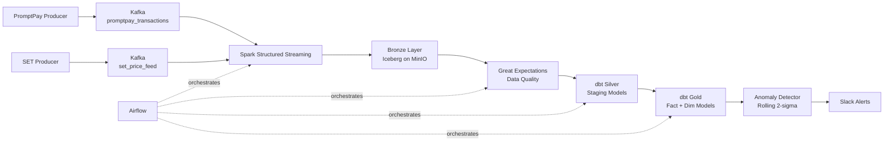

# Thai Financial Data Platform

An end-to-end regulated data platform processing PromptPay transactions and SET equity feeds — with PII masking, full lineage, anomaly alerting, and CI/CD. Built to run without a human watching it.

---

## Architecture



---

## Stack

| Layer | Technology | Why |
|---|---|---|
| Streaming | Apache Kafka | Decouples producers from consumers. Consumer lag is recoverable — a Spark restart picks up from last offset, no data loss. |
| Processing | PySpark Structured Streaming | Handles 10k events/min across partitions. A single Python consumer would bottleneck at scale. |
| Storage | Apache Iceberg v2 on MinIO | Atomic partition overwrites (no empty-partition reads during writes). Row-level deletes for PDPA right-to-erasure. Time travel for audit. |
| Transformation | dbt-spark | Version-controlled SQL with lineage, built-in tests, and source freshness checks. Raw Spark SQL is untestable and undocumented. |
| Orchestration | Apache Airflow | DAG-based scheduling with retry logic, SLA alerts, and dependency tracking. |
| Data Quality | Great Expectations (programmatic) | Validates semantic correctness post-ingestion. No config files — all suites are code, versioned with the pipeline. |
| Observability | Prometheus + Grafana + Slack | Metrics backend, dashboard, and alerting. Statistical baseline (rolling 2-sigma) instead of fixed thresholds. |

---

## Project Structure

```
financial_platform_proj/
├── producers/
│   ├── promptpay_producer.py     # Kafka producer — 10k events/min, 4 fraud patterns
│   └── set_producer.py           # yfinance daily fetch, T+1 correction simulation
├── spark/jobs/
│   └── bronze_ingestion.py       # PySpark Structured Streaming → Iceberg Bronze
├── data_quality/
│   ├── expectations.py           # Great Expectations suites (programmatic, no config files)
│   └── quarantine.py             # Writes failed records to local.bronze.quarantine
├── dbt/thai_platform/models/
│   ├── staging/                  # Silver: dedup, type casting, no business logic
│   └── gold/                     # Gold: fct_transactions, dim_customer_risk_profile (SCD2),
│                                 #       dim_set_ticker, fct_daily_returns
├── airflow/dags/
│   ├── streaming_monitor.py      # Checks Bronze freshness every 5 min
│   ├── dbt_transformation.py     # Hourly Silver → Gold, triggers data quality check
│   ├── data_quality_check.py     # Runs GE validation suite on Bronze
│   ├── iceberg_compaction.py     # Nightly binpack compaction at 02:00
│   └── set_price_ingestion.py    # Daily SET price fetch at 18:00 Asia/Bangkok
├── observability/
│   └── anomaly_detector.py       # Rolling 14-day mean ± 2σ, day-of-week segmented
├── tests/
│   ├── test_masking.py           # PII masking unit tests (15 cases, no Spark required)
│   └── test_transformation.py    # Dedup, negative amount filter, quarantine routing
└── .github/workflows/ci.yml      # PR-gated: pytest + dbt compile
```

---

## Data Sources

**PromptPay transactions** — simulated at 10,000 events/min with a 500-sender pool. Anomaly patterns (velocity burst, amount spike, dormant spike) are structurally valid JSON — the fraud signal is behavioral, not structural. This reflects real fraud detection difficulty.

**SET equity prices** — 20 SET-listed tickers fetched via yfinance daily after market close (18:00 Bangkok time). 10% of runs simulate T+1 price corrections handled via Iceberg `MERGE INTO`.

---

## Key Design Decisions

**Why Iceberg over raw Parquet**
Raw Parquet partition overwrite is not atomic. There is a window between deleting old files and writing new ones where a concurrent read returns zero rows. Iceberg's snapshot-based metadata swap eliminates this — readers see either the old snapshot or the new one, never an empty state.

**Why Iceberg over Delta Lake**
Delta Lake is optimized for Databricks. Outside Databricks, it loses liquid clustering, optimized Z-ordering, and Delta Sharing. On Docker + MinIO, Iceberg is first-class. Delta Lake would be the correct choice on a Databricks deployment.

**Why SHA-256 hash for PII, not encryption**
Hashing is one-way — the same sender always produces the same hash, so joins across tables still work, but the original national ID cannot be recovered. Encryption requires key management infrastructure (rotation, storage, access controls). For analytics under Thai PDPA, pseudonymization via hashing satisfies the compliance requirement with significantly less operational complexity.

**Why 10-minute watermark**
For fraud detection, a 10-minute-late event is too late to act on in real time. The watermark bounds Spark's state memory and enables partition cleanup. Completeness is sacrificed for predictable resource usage — a deliberate tradeoff.

**Why SCD Type 2 for customer risk profile**
Overwriting risk scores destroys the audit trail. You need to know what risk score a customer had at the time of a transaction, not their current score. SCD Type 2 preserves full history with `valid_from`/`valid_to` timestamps, enabling point-in-time joins in `fct_transactions`.

**Why day-of-week segmentation in anomaly detection**
Monday transaction volume is 40-60% higher than Saturday. A naive 14-day rolling mean fires false alerts every weekend as volume drops naturally. Segmenting by day-of-week makes the statistical baseline seasonality-aware.

**Why nightly compaction**
30-second micro-batches produce ~2,880 small files per day per partition. Querying thousands of small files degrades performance — each file requires a separate S3 API call. A nightly Airflow DAG bin-packs files into 128MB targets using Iceberg's `rewrite_data_files`.

---

## PDPA Compliance

Thai PDPA (Personal Data Protection Act, B.E. 2562) classifies national ID numbers as sensitive personal data.

- PII masked in PySpark before Bronze write — unmasked data never reaches the data lake
- `is_pii_masked` audit flag on every Bronze record — auditors can verify with `SELECT COUNT(*) FROM bronze.transactions WHERE is_pii_masked = false` (must return 0)
- Iceberg v2 row-level deletes support right-to-erasure requests without full partition rewrites
- dbt lineage tracking — every Gold record is traceable back to its Bronze source

---

## Running Locally

**Prerequisites:** Docker, Docker Compose

```bash
# Start all services
docker-compose up -d

# Verify services are running
# Airflow:    http://localhost:8080  (admin/admin)
# MinIO:      http://localhost:9001  (minioadmin/minioadmin)
# Grafana:    http://localhost:3000  (admin/admin)
# Prometheus: http://localhost:9090

# Start PromptPay producer (from host)
python producers/promptpay_producer.py

# Start Bronze ingestion (inside Spark container)
spark-submit spark/jobs/bronze_ingestion.py

# Trigger dbt transformation manually
dbt run --project-dir dbt/thai_platform
```

**Environment variables** — copy `.env.example` to `.env` and fill in values. Never commit `.env`.

---

## CI/CD

Every pull request to `main` or `develop` triggers:

1. `pytest tests/test_masking.py` — PII masking correctness
2. `pytest tests/test_transformation.py` — deduplication, negative amount filtering, quarantine routing
3. `dbt compile` — dbt model syntax validation

Merge is blocked on any failure.

---

## Known Limitations

- **Single Kafka broker** — replication factor is 1. In production, minimum 3 brokers with replication factor 3.
- **Hadoop catalog** — uses local filesystem catalog for Iceberg. In production, replace with a dedicated catalog (Hive Metastore or AWS Glue).
- **No schema registry** — Kafka messages are plain JSON. In production, use Confluent Schema Registry to enforce and evolve schemas.
- **Anomaly detector monitors one metric** — only `row_count` on `fct_transactions` is implemented. Production would cover null rates per critical column, freshness, and SET feed latency across all tables.
- **No autoscaling** — Spark runs as a single local session. Production would use YARN or Kubernetes for dynamic resource allocation.
